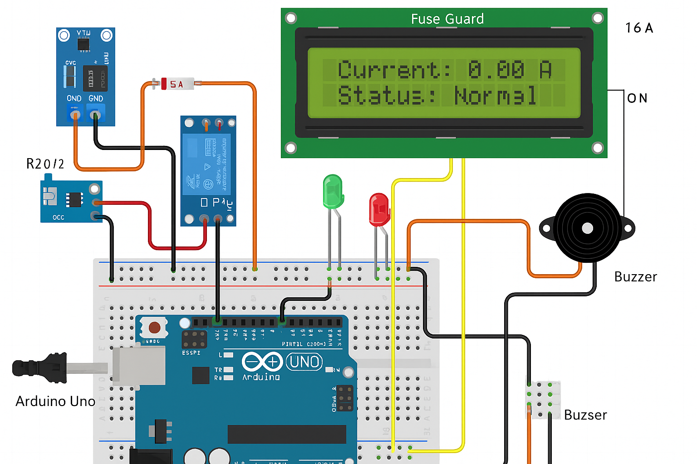

# 🔌 FuseGuard - Circuit Overload Protection System

**FuseGuard** is a smart electronics safety system designed to monitor current flow in a circuit using an ACS712 sensor. It automatically disconnects the circuit using a relay if the current exceeds a safe threshold. Additionally, it displays real-time current on an LCD and provides alerts via LEDs and a buzzer.

---

## 📷 Project Preview



---

## ⚙️ Components Used
# FuseGuard: Circuit Overload Protection System

## Overview
FuseGuard is a smart circuit protection system that monitors current in real-time, detects overloads, and safely disconnects the load using a relay. It uses an ESP32 for control, an ACS712 current sensor for current measurement, and a relay module to cut off the load during overload conditions. The system also displays data on a 16x2 LCD and provides real-time updates via a local web server. A Python script can be used to monitor serial output, and a React web page displays live data.

---

## Components Required Native app or simple Bluetooth terminal for demo

| Component               | Quantity |
|------------------------|----------|
| ESP32 DevKit v1        | 1        |
| ACS712 Current Sensor  | 1        |
| Relay Module (1-Channel)| 1       |
| 16x2 LCD with I2C Module| 1       |
| LED / Buzzer (Optional)| 1        |
| 220-ohm Resistor (for LED)| 1    |
| Breadboard & Jumper Wires | As needed |
| Power supply for load  | 1        |

---

## Circuit Connections

### ACS712 Current Sensor:
- VCC -> ESP32 3.3V (or 5V depending on module)
- GND -> ESP32 GND
- OUT -> ESP32 GPIO36 (Analog input)

### Relay Module:
- VCC -> ESP32 5V
- GND -> ESP32 GND
- IN  -> ESP32 GPIO23
- Relay COM -> Power Source Positive
- Relay NO  -> Load Positive
- Load Negative -> Power Source Negative

### LCD Display (16x2 with I2C):
- VCC -> ESP32 3.3V
- GND -> ESP32 GND
- SDA -> ESP32 GPIO21
- SCL -> ESP32 GPIO22

### Optional LED/Buzzer:
- Positive -> ESP32 GPIO22 via 220-ohm resistor (LED)
- GND -> ESP32 GND

---

## Software Components

### Arduino Code
- Reads analog value from ACS712
- Converts to current
- Controls relay based on overload condition
- Displays data on LCD
- Hosts web server to serve JSON data
- Serial prints data for Python monitoring

### Python Script
- Connects to ESP32 via serial
- Reads and prints all messages in terminal

### React Page
- Fetches data from ESP32 local web server
- Displays current and status

---

## ESP32 WiFi Setup
Replace in code:
```cpp
const char* ssid = "YOUR_WIFI_SSID";
const char* password = "YOUR_WIFI_PASSWORD";
```
Use Serial Monitor to view the IP address of the ESP32 once connected.
Access the data via: `http://<ESP32_IP>/data`

---

## Web Page Access
React app fetches data from `http://<ESP32_IP>/data` and displays:
- Current in Amps
- Status: Normal / Overload

---

## Python Serial Monitoring
Install `pyserial` and use the script to read live data:
```bash
pip install pyserial
```

### Script
```python
import serial

PORT = "COM5"  # Replace with your port
BAUD = 115200

ser = serial.Serial(PORT, BAUD, timeout=1)
while True:
    line = ser.readline().decode('utf-8').strip()
    if line:
        print(line)
```

---

## Install following package from github to use ESP-32

https://raw.githubusercontent.com/espressif/arduino-esp32/gh-pages/package_esp32_index.json

---

## Arduino Code
Install `Arduino IDE` and use the script to connect every hardware:

### Code
```c++
#include <WiFi.h>
#include <WebServer.h>
#include <Wire.h>
#include <LiquidCrystal_I2C.h>

const char* ssid = "YOUR_WIFI_SSID";
const char* password = "YOUR_WIFI_PASSWORD";

const int sensorPin = 36; // Analog pin
const int relayPin = 23;  // Relay control
const float overloadThreshold = 10.0; // Amps

LiquidCrystal_I2C lcd(0x27, 16, 2); // I2C address may be 0x3F or 0x27
WebServer server(80);

float readCurrent() {
  int sensorValue = analogRead(sensorPin);
  float voltage = (sensorValue / 4095.0) * 3.3;
  float current = (voltage - 2.5) / 0.185;
  return current;
}

void updateLCD(float current, String status) {
  lcd.clear();
  lcd.setCursor(0, 0);
  lcd.print("Current: ");
  lcd.print(current, 1);
  lcd.print("A");

  lcd.setCursor(0, 1);
  lcd.print("Status: ");
  lcd.print(status);
}

void handleRoot() {
  server.send(200, "text/html", "<h2>ESP32 FuseGuard</h2><p>Go to <a href='/data'>/data</a></p>");
}

void handleData() {
  float current = readCurrent();
  bool isOverload = current > overloadThreshold;
  String status = isOverload ? "Overload" : "Normal";

  String json = "{";
  json += "\"current\":" + String(current, 2) + ",";
  json += "\"status\":\"" + status + "\"";
  json += "}";

  server.send(200, "application/json", json);
  digitalWrite(relayPin, isOverload ? LOW : HIGH);

  updateLCD(current, status);

  // Also print to Serial
  Serial.print("Current: ");
  Serial.print(current, 2);
  Serial.print(" A | Status: ");
  Serial.println(status);
}

void setup() {
  Serial.begin(115200);
  pinMode(relayPin, OUTPUT);
  digitalWrite(relayPin, HIGH);

  lcd.init();
  lcd.backlight();
  lcd.setCursor(0, 0);
  lcd.print("Connecting...");

  WiFi.begin(ssid, password);
  while (WiFi.status() != WL_CONNECTED) {
    delay(500);
    Serial.print(".");
  }

  Serial.println("\nWiFi connected!");
  Serial.print("IP: ");
  Serial.println(WiFi.localIP());

  lcd.clear();
  lcd.setCursor(0, 0);
  lcd.print("IP: ");
  lcd.setCursor(0, 1);
  lcd.print(WiFi.localIP());

  delay(2000); // Show IP on LCD for demo

  server.on("/", handleRoot);
  server.on("/data", handleData);
  server.begin();
  Serial.println("Server started");
}

void loop() {
  server.handleClient();
}
```

---

## Notes
- Make sure all grounds are connected together
- Ensure ACS712 is rated for the current range you're measuring
- Double-check relay voltage rating for your load

---

## Future Enhancements
- Cloud dashboard (Blynk, Firebase)
- Mobile app integration
- Data logging to SD card or cloud
- SMS/Email alerts for overload

---

Project by: AKSHAY SHARMA
Date: TBD
- Arduino Uno
- ACS712 Current Sensor (5A/20A/30A based on requirement)
- Relay Module (5V)
- 16x2 LCD Display (with I2C backpack)
- Red LED (Overload indicator)
- Green LED (Normal condition)
- Active Buzzer
- Fuse (based on application)
- 220Ω resistors (for LEDs)
- Breadboard, jumper wires

---

## 🔧 Working Principle

1. The ACS712 sensor continuously monitors the current.
2. Current is displayed on a 16x2 LCD.
3. If the current exceeds a preset threshold:
   - Relay disconnects the load
   - Red LED lights up
   - Buzzer sounds to notify overload
4. In normal conditions:
   - Load remains connected
   - Green LED stays on

---

## 🧠 Arduino Sketch Summary

```cpp
#include <LiquidCrystal_I2C.h>

LiquidCrystal_I2C lcd(0x27, 16, 2);

const int sensorPin = A0;
const int relayPin = 8;
const int greenLedPin = 9;
const int redLedPin = 10;
const int buzzerPin = 11;

const float currentThreshold = 5.0; // Adjust threshold as needed

void setup() {
  Serial.begin(9600);
  lcd.begin();
  lcd.backlight();

  pinMode(relayPin, OUTPUT);
  pinMode(greenLedPin, OUTPUT);
  pinMode(redLedPin, OUTPUT);
  pinMode(buzzerPin, OUTPUT);

  digitalWrite(relayPin, HIGH);
  Serial.println("System Initialized. Monitoring current...");
}

void loop() {
  int sensorValue = analogRead(sensorPin);
  float voltage = sensorValue * (5.0 / 1023.0);
  float current = (voltage - 2.5) / 0.185; // For 5A ACS712

  Serial.print("Current: ");
  Serial.print(current);
  Serial.println(" A");

  lcd.clear();
  lcd.setCursor(0, 0);
  lcd.print("Current: ");
  lcd.print(current, 2);
  lcd.print(" A");

  if (abs(current) > currentThreshold) {
    digitalWrite(relayPin, LOW);
    digitalWrite(redLedPin, HIGH);
    digitalWrite(greenLedPin, LOW);
    digitalWrite(buzzerPin, HIGH);
    lcd.setCursor(0, 1);
    lcd.print("Overload! CUT OFF");
    Serial.println("⚠️ Overload detected! Relay OFF.");
  } else {
    digitalWrite(relayPin, HIGH);
    digitalWrite(redLedPin, LOW);
    digitalWrite(greenLedPin, HIGH);
    digitalWrite(buzzerPin, LOW);
    lcd.setCursor(0, 1);
    lcd.print("Status: Normal");
    Serial.println("✅ Current normal. Relay ON.");
  }

  delay(1000);
}
