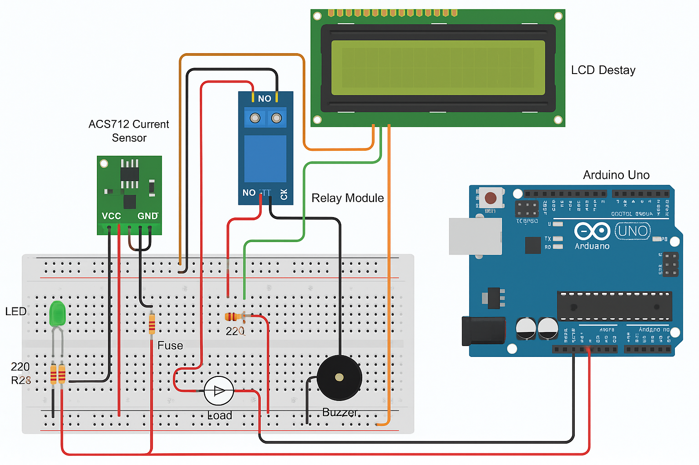

# 🔌 FuseGuard - Circuit Overload Protection System

**FuseGuard** is a smart electronics safety project that uses an **Arduino Uno** to monitor the current flowing through a circuit using an **ACS712 current sensor**. It displays the live current on an **LCD**, and if the current exceeds a predefined threshold, it:

- Cuts power using a **relay module**
- Activates a **buzzer**
- Turns on a **red LED** to indicate an overload
- Keeps a **green LED** ON under safe conditions

---

## 📷 Project Preview



---

## ⚙️ Components Used

| Component                   | Quantity |
|----------------------------|----------|
| Arduino Uno                | 1        |
| ACS712 Current Sensor (5A/20A/30A) | 1 |
| Relay Module (5V)          | 1        |
| 16x2 LCD (with I2C module) | 1        |
| Red LED (Overload)         | 1        |
| Green LED (Normal)         | 1        |
| Buzzer                     | 1        |
| 220Ω Resistors (for LEDs)  | 2        |
| Breadboard & Jumper Wires  | As Needed |
| Fuse (based on current rating) | 1    |

---

## 🔌 Circuit Connections

### ACS712 Current Sensor:
- **VCC** -> Arduino 5V  
- **GND** -> Arduino GND  
- **OUT** -> Arduino A0

### Relay Module:
- **VCC** -> Arduino 5V  
- **GND** -> Arduino GND  
- **IN**  -> Arduino D8  
- **Relay COM** -> Power source positive  
- **Relay NO**  -> Load positive  
- **Load negative** -> Power source negative

### 16x2 LCD with I2C:
- **VCC** -> Arduino 5V  
- **GND** -> Arduino GND  
- **SDA** -> Arduino A4  
- **SCL** -> Arduino A5  

### LEDs and Buzzer:
- **Red LED** -> D10 (with 220Ω resistor)
- **Green LED** -> D9 (with 220Ω resistor)
- **Buzzer** -> D11

---

## 🧠 Arduino Sketch Summary

```cpp
#include <LiquidCrystal_I2C.h>

LiquidCrystal_I2C lcd(0x27, 16, 2);

const int sensorPin = A0;
const int relayPin = 8;
const int greenLedPin = 9;
const int redLedPin = 10;
const int buzzerPin = 11;

const float currentThreshold = 5.0; // Adjust based on your circuit

void setup() {
  Serial.begin(9600);
  lcd.begin();
  lcd.backlight();

  pinMode(relayPin, OUTPUT);
  pinMode(greenLedPin, OUTPUT);
  pinMode(redLedPin, OUTPUT);
  pinMode(buzzerPin, OUTPUT);

  digitalWrite(relayPin, HIGH); // Assume HIGH is ON
  Serial.println("System Initialized. Monitoring current...");
}

void loop() {
  int sensorValue = analogRead(sensorPin);
  float voltage = sensorValue * (5.0 / 1023.0);
  float current = (voltage - 2.5) / 0.185; // Calibration for 5A ACS712

  Serial.print("Current: ");
  Serial.print(current);
  Serial.println(" A");

  lcd.clear();
  lcd.setCursor(0, 0);
  lcd.print("Current: ");
  lcd.print(current, 2);
  lcd.print(" A");

  if (abs(current) > currentThreshold) {
    digitalWrite(relayPin, LOW);      // Cut the load
    digitalWrite(redLedPin, HIGH);
    digitalWrite(greenLedPin, LOW);
    digitalWrite(buzzerPin, HIGH);
    lcd.setCursor(0, 1);
    lcd.print("Overload! CUT OFF");
    Serial.println("⚠️ Overload detected! Relay OFF.");
  } else {
    digitalWrite(relayPin, HIGH);     // Allow the load
    digitalWrite(redLedPin, LOW);
    digitalWrite(greenLedPin, HIGH);
    digitalWrite(buzzerPin, LOW);
    lcd.setCursor(0, 1);
    lcd.print("Status: Normal");
    Serial.println("✅ Current normal. Relay ON.");
  }

  delay(1000);
}
